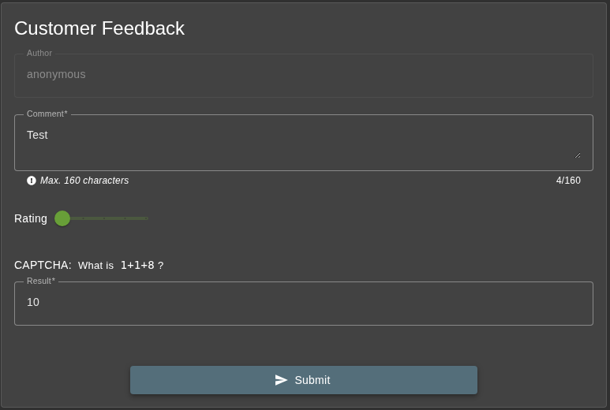
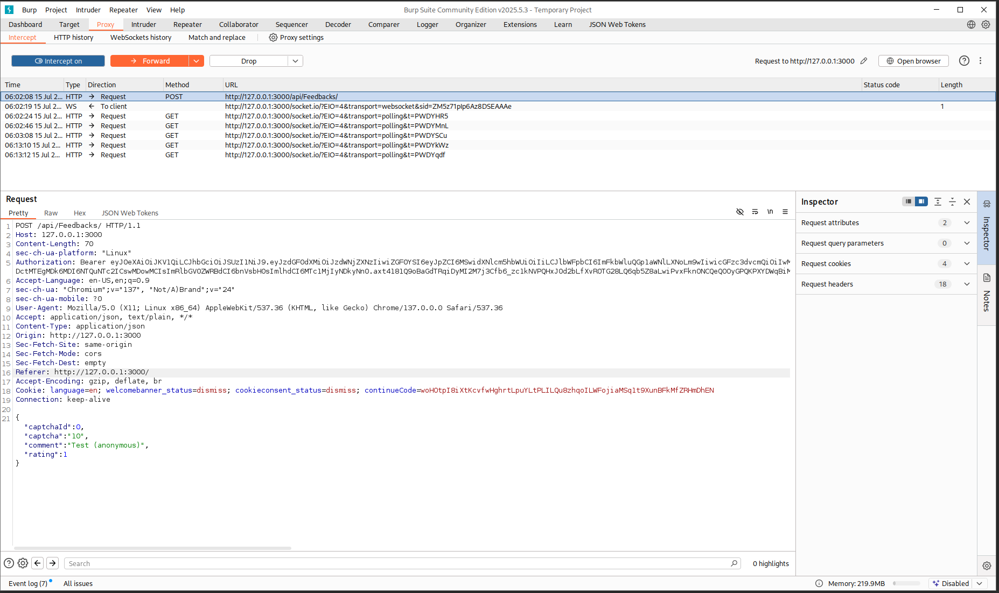
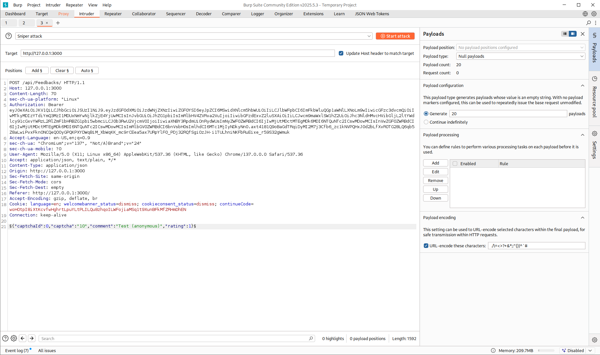
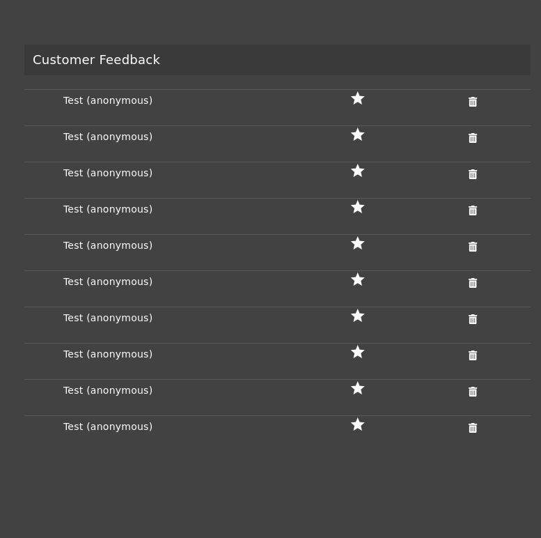

# CAPTCHA Bypass ★★★

Submit 10 or more customer feedbacks within 20 seconds.

## Broken Anti Automation

## Vulnerability Impact

Exploiting a CAPTCHA bypass allows attackers to flood feedback forms with automated spam, corrupt analytics, overwhelm server resources, facilitate large‑scale attacks on other vulnerabilities, and ultimately erode user trust.

## Prerequisites

- Burp Suite (Proxy & Intruder)
- OWASP Juice Shop with a customer‑feedback form

## Steps to Reproduce

1. **`Open the Customer Feedback page <http://127.0.0.1:3000/#/contact>`**

    - Fill in and submit the feedback form

    

2. **Intercept with Burp Suite**

    - In Proxy find the `POST /api/Feedbacks` request.
    - Right‑click → **Send to Intruder**.

3. **Verify the intercepted request**  

    ```bash
    PUT /api/products/42 HTTP/1.1
    Host: 127.0.0.1:3000

    {"captchaId":0,"captcha":"10","comment":"Test (anonymous)","rating":1}
    ```

    

4. **Configure Intruder**

    - Click Clear §.
    - Highlight the entire JSON payload:

    ```bash
    {"captchaId":0,"captcha":"10","comment":"Test (anonymous)","rating":1}
    ```

    - and click Add §.

    ```bash
    §{"captchaId":0,"captcha":"10","comment":"Test (anonymous)","rating":1}§
    ```

    - Under the Attack type, select Sniper.
    - Switch to the Payloads tab:
    - Payload type: Null payloads
    - Payload count: 20

    

5. **Launch the attack**

    - Click Start attack.
    - Intruder will replay that same JSON 20 times, bypassing the CAPTCHA rate‑limit.

6. **Verify results**

    - Open your admin page at **`<http://127.0.0.1:3000/#/administration>`**
    - Confirm that 20 feedback entries have been recorded.

    

> **Tip:** For extremely high‑volume or tightly‑timed attacks, install Turbo Intruder (Extender → BApp Store). It uses an async engine to fire off thousands of requests per second—perfect for stress‑testing rate limits or bypass windows smaller than Intruder’s default threading can handle.
