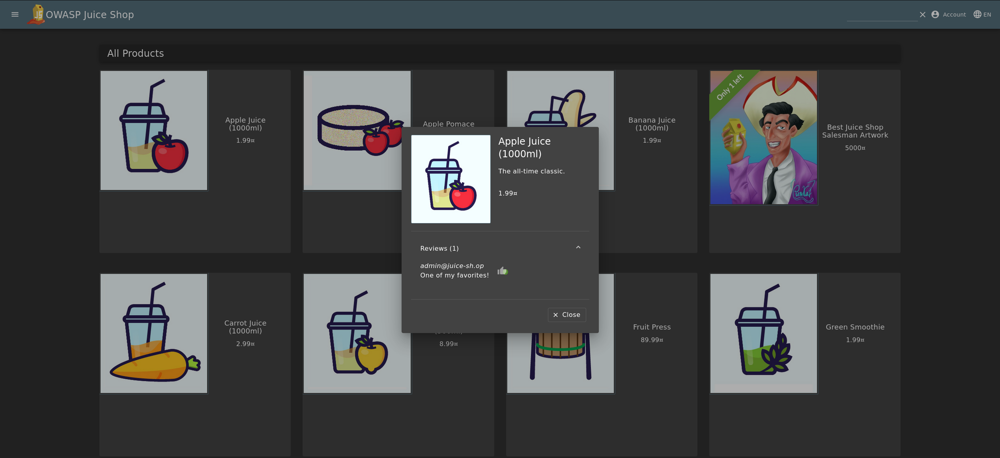
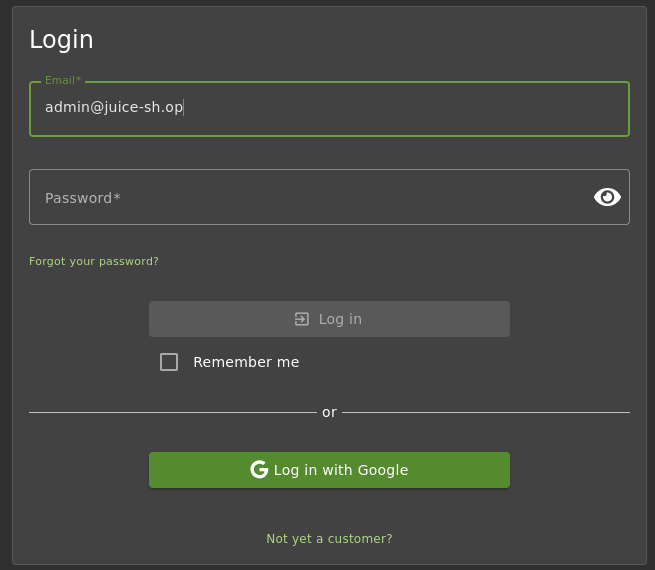
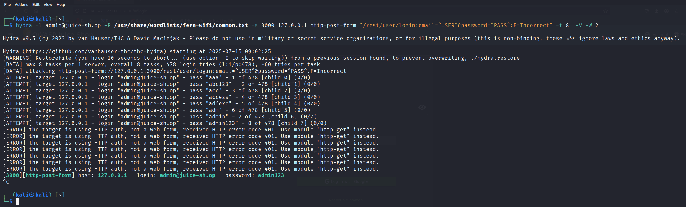

# Login Admin ★★

Log in with the administrator's user account.

## Injection

## Vulnerability Impact

Injection vulnerabilities allow attackers to send crafted input that the system executes as code, leading to data theft or manipulation, unauthorized command execution, privilege escalation, service disruption, and full system compromise.

## Prerequisites

- OWASP Juice Shop running at **`<http://127.0.0.1:3000/#/login>`**

## Steps to Reproduce

1. **Find the admin email**
    - Review the Apple Juice review to discover the administrator’s email address.

    

2. **Go to Login**
    - Navigate to **`<http://127.0.0.1:3000/#/login>`**.  

    

3. **Brute‑force the admin password with Hydra**

    ```bash
    hydra -l admin@juice‑sh.op -P /usr/share/wordlists/common.txt  -s 3000 127.0.0.1 http-post-form "/rest/user/login:email=^USER^&password=^PASS^:F=Incorrect"  -t 8 -V -W 2 
    ```

    - -l admin@juice‑sh.op
        Use the single username admin@juice‑sh.op. (If you had multiple usernames, you’d use -L usernames.txt.)
    - -P /usr/share/wordlists/common.txt
        The password list file to try, one password per line.
    - -s 3000
        Connect to port 3000 on the target (Juice Shop’s default HTTP port in this setup).
    - 127.0.0.1
        The target host (localhost).
    - http-post-form
        Tells Hydra to use its “form‑based POST” module rather than HTTP Basic or FTP, etc.
    - "/rest/user/login:email=^USER^&password=^PASS^:F=Incorrect"

    /rest/user/login → the URL path to POST to

    email=^USER^&password=^PASS^ → form fields, where ^USER^ is replaced by the -l value and ^PASS^ by each candidate from the -P list

    F=Incorrect → the failure string: if the response body contains “Incorrect”, Hydra treats that attempt as a bad login and moves on
    - -t 8
    Spin up 8 parallel tasks (threads) to speed up the attack.
    - -V
    Very verbose output—prints every attempt, useful for debugging.
    - -W 2
    Wait 2 seconds after each login attempt (across all threads). This throttles your speed so you don’t trip rate limits.

    

4. **Log in**  

    - Use the discovered password to sign in at **`<http://127.0.0.1:3000/#/login>`** with the admin email and password.

> **Tip:**  If Juice Shop is served over HTTPS, add the -S flag to Hydra to skip certificate validation when brute‑forcing.
