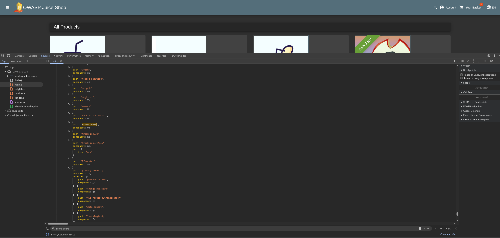
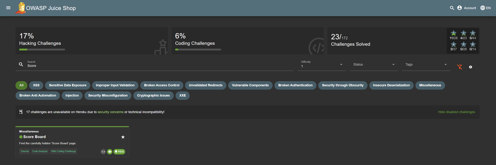

# Score Board ★

## Miscellaneous

Find the carefully hidden 'Score Board' page.

## Vulnerability Impact

Miscellaneous vulnerabilities encompass a broad spectrum of flaws—such as misconfigurations, insecure defaults, and business‑logic errors—that attackers can exploit to bypass controls, leak data, or disrupt services.

## Prerequisites

- OWASP Juice Shop running at **`<http://127.0.0.1:3000/#/>`**

## Steps to Reproduce

1. **Open OWASP Juice Shop**

    - Navigate to **`<http://127.0.0.1:3000/#/>`**.

2. **Open Dev Tools**

    - Right‑click on the page and choose **Inspect**, or press `F12`.  

3. **Go to the Sources panel**

    - In DevTools, select **Sources** and locate the `main.js` file.

4. **Search for `score-board`**

    - Press `Ctrl+F` and enter `score-board`.  
    - The 7th occurrence shows the hidden route for the Score Board.

    

5. **Check for the Scoreboard**

    - Copy the discovered path (e.g. `score-board`) into your browser’s URL bar

    

> **Tip:** While browsing `main.js`, look for other route names (e.g. `administration`)—they often point to additional hidden pages or challenges.
